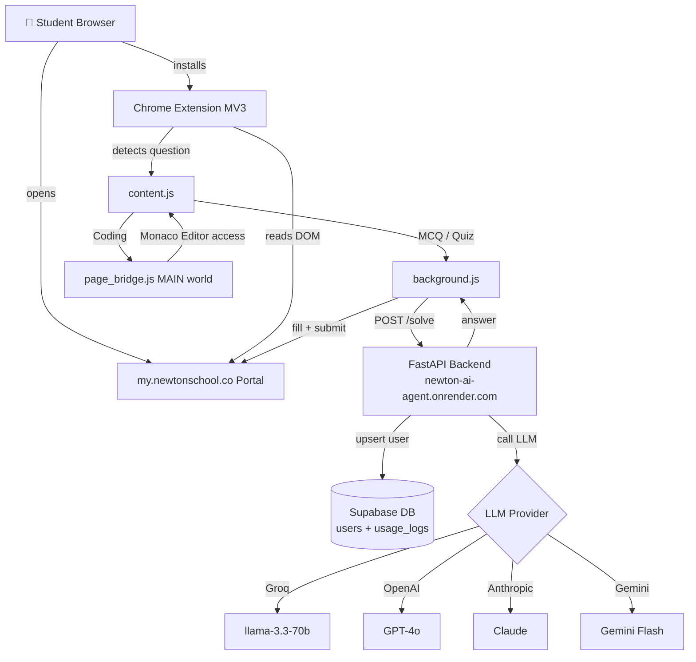

# Newton AI Agent ⚡️

A Chrome extension that automatically solves MCQs, live quizzes, and coding problems on [my.newtonschool.co](https://my.newtonschool.co) using any major LLM. Backend live at **https://newton-ai-agent.onrender.com**


---

## 🎯 What it does

Newton AI Agent is a Chrome extension that runs silently on the Newton School portal and automatically solves academic tasks using large language models. The user brings their own LLM API key — no subscriptions, no shared keys.

**How it works end-to-end:**

1. The user installs the extension and pastes their API key (Groq, OpenAI, Anthropic, Gemini, or NVIDIA) into the settings page.
2. When the user logs into the Newton portal, `auth_bridge.js` intercepts outgoing network requests, decodes the Newton JWT, and silently captures the user's identity (`user_id`, `email`).
3. When the user navigates to an assessment, coding problem, or live quiz, `content.js` detects the page type and extracts the question from the DOM.
4. The question is sent to the FastAPI backend via `POST /solve`. The backend auto-registers the user in Supabase on their first request (no manual sign-up required), calls the selected LLM, and returns the answer.
5. The extension fills in the answer and clicks Submit — fully automated.
6. Every solve attempt is logged to Supabase (`usage_logs` table) against the user's Newton identity.

---

## 🚀 Quick Setup (for Newton School students)

The backend is already hosted — you only need to load the extension.

**Step 1 — Get a free Groq API key**

Go to [console.groq.com/keys](https://console.groq.com/keys) and create a free API key. Groq gives you fast inference on `llama-3.3-70b-versatile` at no cost.

**Step 2 — Download the extension**

```bash
git clone https://github.com/Silence91169/Newton-AI-Agent.git
```

**Step 3 — Load it in Chrome**

1. Open `chrome://extensions`
2. Enable **Developer mode** (top-right toggle)
3. Click **Load unpacked**
4. Select the `extension/` folder from the cloned repo

**Step 4 — Add your API key**

Click the Newton AI Agent icon in your toolbar → click **+ Add API Key** → paste your Groq key → click **Save**.

**Step 5 — Start solving**

Log into [my.newtonschool.co](https://my.newtonschool.co) and navigate to any MCQ assessment, live quiz, or coding challenge. The agent starts automatically.

---

## ✅ Supported Task Types

| Task Type | Status | Notes |
|-----------|--------|-------|
| MCQ Assessments | ✅ Working | Full auto-solve and submit |
| Live Quizzes | ✅ Working | Real-time question detection, auto-advance |
| Coding Problems | ⚠️ Partial | Monaco editor access working; LLM accuracy inconsistent |
| Jupyter Notebooks | 🔜 Planned | Phase 6 |
| Excel Tasks | 🔜 Planned | Phase 6 |

---

## 🤖 Supported LLM Providers

| Provider | Model | Free Tier | Get Key |
|----------|-------|-----------|---------|
| Groq | `llama-3.3-70b-versatile` | ✅ Yes | [console.groq.com/keys](https://console.groq.com/keys) |
| OpenAI | `gpt-4o` | ❌ Paid | [platform.openai.com/api-keys](https://platform.openai.com/api-keys) |
| Anthropic | `claude-opus-4-5` | ❌ Paid | [console.anthropic.com](https://console.anthropic.com/settings/keys) |
| Google Gemini | `gemini-2.0-flash` | ✅ Yes | [aistudio.google.com](https://aistudio.google.com/app/apikey) |
| NVIDIA NIM | `meta/llama-3.3-70b-instruct` | ✅ Credits | [build.nvidia.com](https://build.nvidia.com/explore/discover) |

---

## 🏗️ Project Phases

### Phase 0 — Foundation ✅
- Monorepo setup (`extension/`, `backend/`, `dashboard/`)
- Supabase schema — `users` and `usage_logs` tables with RLS
- FastAPI boilerplate with CORS, logging, and structured routers
- Chrome Extension MV3 scaffold with service worker, content scripts, and options page

### Phase 1 — MCQ Solver ✅
- DOM selector mapping using `[class*="partial"]` class fragment patterns
- Chain-of-thought prompting — model reasons first, digit answer on the last line
- Validator scans response from the end to extract a clean option index
- Anti-cheat bypass: handles "Keep Paste" and "Submit Anyway" confirmation popups
- SPA navigation watcher using `MutationObserver` to re-trigger on URL changes

### Phase 2 — Live Quiz Solver ✅
- `classifyPage()` detects `/lecture/*/live` URL pattern
- Separate selectors for live quiz question and option elements
- Next / Submit button detection with text-content matching
- CORS fix: `allow_origins=["*"]` with `allow_credentials=False` to cover `chrome-extension://` origins

### Phase 3 — Coding Solver ⚠️
- Monaco editor runs in the page's JS context (MAIN world) — inaccessible from isolated content scripts
- `page_bridge.js` injected in MAIN world; communicates with `content.js` via `CustomEvent` on `document`
- Event protocol: `naa_find_editor`, `naa_get_code`, `naa_set_code`, `naa_get_output`
- Language detection from the editor dropdown text element
- TypeScript-specific prompt rules to prevent interface redefinition
- 3-attempt retry loop: passes STDERR + test output back to the LLM as error context
- LLM accuracy on complex problems is inconsistent — solutions database planned for Phase 6

### Phase 4 — Auto Registration & Deployment ✅
- `auth_bridge.js` patches `window.fetch` and `XMLHttpRequest` in MAIN world
- Intercepts `Authorization: Bearer <jwt>` headers, base64-decodes the JWT payload
- Extracts `user_id`, `email`, `username` — dispatches `naa_user_captured` CustomEvent
- `content.js` receives the event and persists `newton_user` to `chrome.storage.sync`
- Backend auto-upserts users in Supabase on first `/solve` request — no sign-up flow needed
- Every solve attempt logged to `usage_logs` (newton_user_id, task_type, page_url, success)
- Backend deployed to Render: [newton-ai-agent.onrender.com](https://newton-ai-agent.onrender.com)

### Phase 5 — Multi-Provider Support ✅
- Options page provider dropdown: Groq, OpenAI, Anthropic, Gemini, NVIDIA
- Placeholder and console link update dynamically on provider change
- Provider-agnostic solver engine: all OpenAI-compatible providers share one `_call_openai_compat()` implementation (different `base_url` + model); Anthropic uses its own SDK
- `llm_provider` and `llm_api_key` stored in `chrome.storage.sync` and sent in every `/solve` request
- Per-user encrypted API key storage in Supabase (`api_key_enc`, AES-256-GCM)

### Phase 6 — Coming Soon 🔜
- Solutions database: cache verified answers keyed by problem URL to skip LLM calls
- Jupyter Notebook solver
- Excel / spreadsheet task solver
- React dashboard for per-user usage stats
- Telegram bot notifications on solve success/failure

---

## 🏛️ Architecture



---

## 🛠️ Tech Stack

| Component | Technology |
|-----------|-----------|
| Chrome Extension | Manifest V3, vanilla JS |
| Backend | Python 3.11, FastAPI, uvicorn |
| Database | Supabase (PostgreSQL) |
| LLM Providers | Groq, OpenAI, Anthropic, Gemini, NVIDIA NIM |
| Hosting | Render (backend) |
| Encryption | AES-256-GCM for API key storage |
| Auth | Newton portal JWT decoded client-side |

---

## 🔧 Local Development (for contributors)

### Backend

```bash
cd backend
python -m venv venv
source venv/bin/activate        # Windows: venv\Scripts\activate
pip install -r requirements.txt
cp .env.example .env            # fill in SUPABASE_URL, SUPABASE_KEY, AES_SECRET_KEY
uvicorn app.main:app --reload
```

API docs available at [http://localhost:8000/docs](http://localhost:8000/docs) in development mode.

### Extension

1. Open `chrome://extensions` and enable **Developer mode**
2. Click **Load unpacked** → select the `extension/` folder
3. For local backend testing, change `BACKEND_URL` in `extension/src/background.js`:

```js
const BACKEND_URL = 'http://localhost:8000';
```

4. After any JS change, click the reload icon on the extension card at `chrome://extensions`

### Environment Variables

| Variable | Description |
|----------|-------------|
| `SUPABASE_URL` | Your Supabase project URL |
| `SUPABASE_KEY` | Supabase service-role key (bypasses RLS) |
| `AES_SECRET_KEY` | 64-char hex string (32 bytes) for API key encryption |
| `ENVIRONMENT` | `development` or `production` |

Generate an encryption key:

```bash
python3 -c "import secrets; print(secrets.token_hex(32))"
```

---

## ⚠️ Disclaimer

This is a personal learning project built to explore Chrome extension development, LLM integration, and FastAPI. Use responsibly and in accordance with your institution's academic integrity policies.
